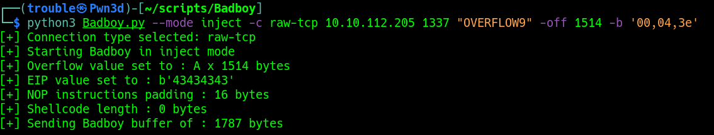

# Badboy


## Fuzzing

In order to Fuzz the application we need to select the connection type and also supplying the IP, Port and Prefix.
The Prefix can be HTTP POST parameters or a command from a program, e.g in that context Help would be the Prefix: 
```
HELP AAAAAAAAAAAAAAAAAAAAAAAAAAAAAAAAA
```


## Testing and Filtering Bad Char

Bad char can be filtered quickly and easily directly from the shell.
Simply start by providing the Bad char (\x00) or "00" in our case.
All Badchars needs to be coma seperated like followed : 
```
-b "00,41,2f"
```


Repeat the process until every Bad chars have been filtered out.



## Trigger the Exploit 
Once you have the eliminated all the Bad chars, that you have your Offset and your have the value of EIP.
Put the Shell code in the place reserved for it in the script and fire the exploit like the screenshot below: 

